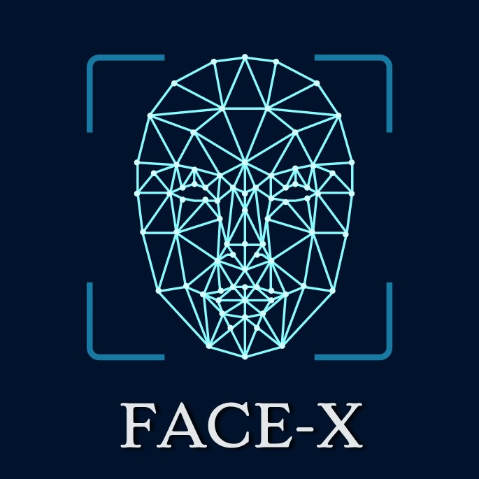

# Face-App-Recognition---Group5

Computer Vision Project - Face App Recognition

## Description

L'Application de Reconnaissance Faciale est un outil qui vous permet de reconnaître des visages dans des photos chargées et d'extraire des informations sur les personnes détectées. Cette application utilise la vision par ordinateur et l'apprentissage profond pour réaliser cette tâche de manière précise.
Cet application ci-présent permet de reconnaitre les visages de 5 certains start de marvel :
 - Robert Downey Junior
 - Mark ruffalo
 - Chris Evans
 - Chris Hemsworth
 - Scarlett Johanson

## Fonctionnalités

- Détection de visages à partir d'une image chargée
- Extraction du nom de la personne sur l'image
- Affichage des résultats de reconnaissances

## Installation

1 - Clonez ce dépôt sur votre machine locale.
2 - Assurez vous d'avoir python installé.
3 - Installer les dépendances nécessaires en éxécutant "pip install -r requirements.txt"

## Utilisation

1 - Exécutez l'application en utilisant la commande suivante "streamlit run main.py"
2 - Aller dans le navigateur ou l'application va s'ouvrir automatiquement
3 - Charger une photo
4 - L'application va ensuite détecter les visages et affichera les résultats

## Auteurs

- Mor Codou SECK  
- Abdou Samath YATTE
- OUIDENG Modeste
- Sergeo SELAGSA MOFFO
- Massaly SANA
- Ibrahim SAWADOGO
